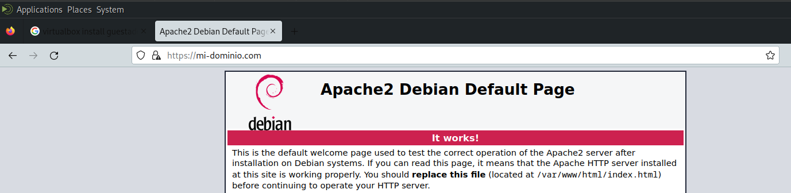

#  Configurar un Servidor Seguro con SSL/TLS Utilizando OpenSSL
<!-- hide -->

> By [@rosinni](https://github.com/rosinni) and [other contributors](https://github.com/breatheco-de/set-up-an-SSL-in-openSSL-with-a-secure-server/graphs/contributors) at [4Geeks Academy](https://4geeksacademy.co/)

[](https://4geeks.com)
[](https://twitter.com/4geeksacademy)

*These instructions are [available in english](https://github.com/breatheco-de/set-up-an-SSL-in-openSSL-with-a-secure-server/blob/main/README.md)*
<!-- endhide -->


<!-- hide -->


### Antes de empezar...

> ¡Te necesitamos! Estos ejercicios se crean y mantienen en colaboración con personas como tú. Si encuentras algún error o falta de ortografía, contribuye y/o repórtalo.

<!-- endhide -->

## 🌱 ¿Cómo empezar este proyecto?

Este ejercicio tiene como objetivo enseñar a los estudiantes a configurar un servidor seguro utilizando OpenSSL para proporcionar comunicaciones seguras mediante SSL/TLS.

### Requisitos

* Una máquina virtual Debian instalada en VirtualBox. (usaremos la máquina previamente configurada en clases anteriores).


## 📝 Instrucciones

* Abre esta URL y forkea el siguiente repositorio https://github.com/breatheco-de/set-up-an-SSL-in-openSSL-with-a-secure-server

 

Un nuevo repositorio se creará en tu cuenta.

* Clona este nuevo repositorio forkeado utilizando Git para descargartelo a tu maquina local.
* Una vez que hayas clonado, sigue los pasos de mas abajo hasta el final.


### Paso 1: Generar una clave privada y una solicitud de Firma de Certificado (CSR):
- [ ] Abre una terminal y ejecuta el siguiente comando para generar una clave privada RSA de 2048 bits:
    ```sh
    openssl genrsa -out /etc/ssl/private/myserver.key 2048
    ```
> 💡Asegúrate de proteger esta clave privada adecuadamente.

<!-- ### Paso 2: Generar una Solicitud de Firma de Certificado (CSR): -->
- [ ] Utiliza el siguiente comando para generar un CSR que contendrá la información pública que se incluirá en el certificado:
    ```sh
    openssl req -new -key /etc/ssl/private/myserver.key -out /etc/ssl/certs/myserver.csr
    ```
**Durante el proceso, se te pedirá que ingreses información sobre tu organización.** 
   (Aquí hay un ejemplo de cómo puedes completarlo):
  * Country Name (2 letter code): ES
  * State or Province Name (full name): Madrid
  * Locality Name (eg, city): Madrid
  * Organization Name (eg, company): MiEmpresa
  * Organizational Unit Name (eg, section): IT
  * Common Name (eg, fully qualified host name): mi-dominio.com
  * Email Address: admin@mi-dominio.com


### Paso 2: Firmar el CSR para Obtener un Certificado Autofirmado:
- [ ] Para propósitos de esta práctica, firmaremos el CSR con nuestra propia clave privada para obtener un certificado autofirmado, utiliza el siguiente comando (Esto generará un certificado autofirmado válido por 365 días):

    ```sh
    openssl x509 -req -days 365 -in /etc/ssl/certs/myserver.csr -signkey /etc/ssl/private/myserver.key -out /etc/ssl/certs/myserver.crt
    ```

### Paso 3: Configurar Apache para Usar el Certificado SSL:
- [ ] Verifica el archivo de configuración SSL de Apache:

    ```sh
    sudo nano /etc/apache2/sites-available/default-ssl.conf
    ```

- [ ] Asegúrate de que el archivo contenga lo siguiente:

      ```sh
      <IfModule mod_ssl.c>
          <VirtualHost _default_:443>
              ServerAdmin admin@mi-dominio.com
              ServerName mi-dominio.com

              DocumentRoot /var/www/html

              SSLEngine on
              SSLCertificateFile /etc/ssl/certs/myserver.crt
              SSLCertificateKeyFile /etc/ssl/private/myserver.key

              <FilesMatch "\.(cgi|shtml|phtml|php)$">
                  SSLOptions +StdEnvVars
              </FilesMatch>
              <Directory /usr/lib/cgi-bin>
                  SSLOptions +StdEnvVars
              </Directory>

              BrowserMatch "MSIE [2-6]" \
                  nokeepalive ssl-unclean-shutdown \
                  downgrade-1.0 force-response-1.0

              BrowserMatch "MSIE [17-9]" ssl-unclean-shutdown

          </VirtualHost>
      </IfModule>
      ```
### Paso 4: Habilitar el Sitio SSL y el Módulo SSL:
- [ ] Utiliza los siguientes comandos:

    ```sh
    sudo a2enmod ssl
    sudo a2ensite default-ssl
    ```
### Paso 5: Actualizar el Archivo Hosts:
- [ ] Verifica el archivo /etc/hosts en tu máquina local (desde donde accedes a la máquina virtual) para asegurar que mi-dominio.com se resuelva a 127.0.0.1

    ```sh
    sudo nano /etc/hosts
    ```
  > 💡 Asegúrate de Agregar la línea:
    * 127.0.0.1 mi-dominio.com

<!-- ### Paso 7: Reiniciar la Máquina Virtual: -->
- [ ] Reinicia la máquina virtual para aplicar todos los cambios

   <!-- ```sh
   sudo reboot
   ``` -->
### Paso 6: Probar la Conexión:
- [ ] Abre un navegador web e ingresa la URL https://mi-dominio.com. Deberías ver una advertencia de seguridad debido al certificado autofirmado. Acepta el riesgo y continúa para ver la página predeterminada de Apache servida a través de HTTPS.




> 💡 NOTA: Para los efectos de este ejercicio educativo, si bien el uso de localhost con HTTPS (https://localhost/) es suficiente para demostrar la configuración básica de SSL/TLS utilizando OpenSSL, incluir la configuración de un dominio personalizado como mi-dominio.com proporciona un aprendizaje más completo y práctico. Este paso adicional permite entender cómo funciona la resolución de DNS en un entorno real. Al generar el certificado SSL/TLS, es crucial que el nombre de dominio (Common Name) coincida con el dominio utilizado para acceder al servidor, evitando así errores y advertencias de seguridad en los navegadores. Esto refuerza la comprensión de conceptos esenciales y mejora las habilidades prácticas necesarias para manejar configuraciones de SSL/TLS en un entorno profesional.

## 🚛 ¿Cómo entregar este proyecto?

Hemos desarrollado un script para ayudarte a medir tu éxito durante este proyecto.

- [ ] En la carpeta `./assets` encontraras el script [check_ssl.sh](https://github.com/breatheco-de/set-up-an-SSL-in-openSSL-with-a-secure-server/blob/main/assets/check_ssl.sh) que deberás copiar y pegar en el escritorio de tu máquina virtual de Debian.

- [ ] Una vez pegado el script [check_ssl.sh](https://github.com/breatheco-de/set-up-an-SSL-in-openSSL-with-a-secure-server/blob/main/assets/check_ssl.sh) en tu maquina Debian, abre la terminal y navega al directorio donde se encuentra el script, en nuestro caso `./Escritorio` y haz que el script sea ejecutable (si aún no lo es). Esto se puede hacer usando el comando `chmod`:

```sh
chmod +x check_ssl.sh
```

- [ ] Ejecuta el script especificando su nombre. También pueden proporcionar cualquier argumento necesario. Asumiendo que no se necesitan argumentos adicionales para este ejemplo, deben ejecutar:

```sh
./check-rules.sh
```

- [ ] **Carga tus resultados.** La ejecucion del script te creara un archivo `report.json` que deberas copiar y pegarlo en la raíz de este proyecto. 

